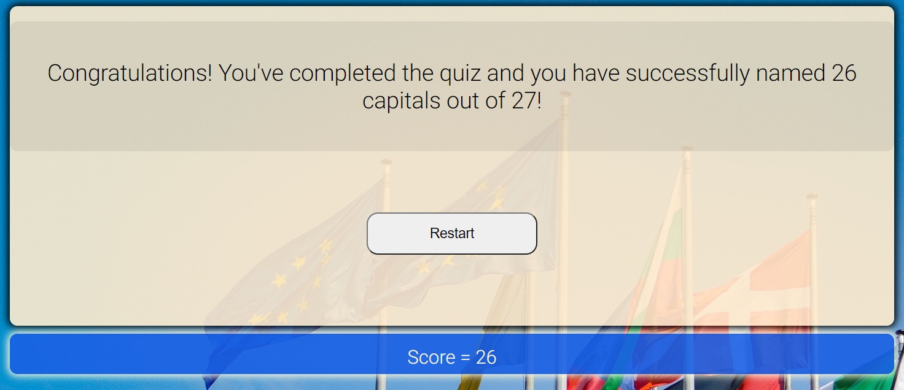

# EU Capitals Quiz

EU Capitals Quiz is a fun and informative game. There are around 50 countries in total in Europe. But currently, there are only 27 countries that are members of the european Union. In this game, the player will be tested if they can successfully name the capitals of these 27 countries.

It is a multiple choice type of game where a player can only select one answer for every question. Each time the player clicks on the desired choice, the player cannot deselect or choose another answer. Each correct answer will be accumulated as the game progresses and the final total score will be shown at the end.

## Features ##
- ### The Header ###
    - The header of the page features the name of the game.
    - This section is displayed in big font and is separated from the navigation bar to highlight the importance of the name of the 
      game.

 

- ### Navigation ###
    - The navigation bar is located at the top of the website. It is simple yet an effective feature of the website.
    - The navigation includes three links to different sections and these are accessible in each page.
    - This feature provides easy navigation for users from page to page across different devices.

 

- ### Game Introduction ###
    - The introduction features basic information about the European Union.
    - This section features a play button that links to the game page.

 

- ### Footer Section ###
    - The footer section of the game is a simple section that provides a social media link to Facebook.
    
 

 

- ### Game Page ###
    - The game page section features a welcome area for players and a start button before proceeding to the actual game.
    - The game features four choices for each question and a next button that is only activated once the answer has been chosen.
    - The last page of the game displays a congratulations message with the total score after completing the game

 

- ### Guide Page ###
    - This page features a guide for players on how to play the game.
    - There is also a form provided for questions, comments and recommendations for the game.
    - The contact form collects four essential information from the users: full name, email address, phone number and message. 
 

 

## Testing ##

- I have tested this page in three different browsers including Chrome, Firefox and Microsoft Edge.
    - Firefox 

    

    - Microsoft Edge

    

    - Google Chrome

    

- I confirmed that the project is responsive and functions in various screen sizes using the devtools device toolbar.
    - Laptops

    

    - Tablets

    
    
    - Phones

    
    
- I confirmed that the features of the website including the navigation bar, heading, contents and other sections are completely clear and easy to understand.
- I have confirmed that the contact form works and that each input field will only accept the required details from the users and that the send message button works correctly.

 

### Bugs ###
- No bugs identified.

### Validator Testing ###
- HTML - No errors were returned when passing through the official [**W3C validator**](https://validator.w3.org/#validate_by_input+with_options)
    - Main Page
        
    - About Page
        
    - Contact Page
        

- CSS - No errors were found when passing through the official [**(Jigsaw) validator**](https://jigsaw.w3.org/css-validator/#validate_by_input)
    - 

 

## Deployment ##
- The site was deployed to GitHub pages. The steps to deploy are as follows:
    - Open a web browser (like Chrome, Firefox or Edge)
    - Login to Github and locate repositories.
    - In the GitHub repository, navigate to the Settings tab.
    - Go to pages tab and from the source section drop-down menu, select the main Branch and then click save button.
    - Once the main branch has been selected and saved, the page provided a link the completed website. 
The live link can be found here - https://jtm2021.github.io/keto-bubble/

 

## Credits ##

### Content ###
- Some codes were inspired by the Love Running Project.

### Media ###

- The images included in the website were taken from [Pexels.com](https://www.pexels.com/). The links are provided below:
    - https://www.pexels.com/photo/hamburger-and-fries-photo-2983101/
    - https://www.pexels.com/photo/salmon-dish-with-vegetables-1516415/
    - https://www.pexels.com/photo/man-pouring-drink-on-woman-s-glass-3184181/
    - https://www.pexels.com/photo/assorted-vegetable-lot-1300972/
    - https://www.pexels.com/photo/woman-slicing-gourd-1153369/
    - https://www.pexels.com/photo/photo-of-vegetables-and-fruit-on-table-4117543/
    - https://www.pexels.com/photo/photo-of-vegetable-salad-in-bowls-1640770/
    - https://www.pexels.com/photo/white-and-black-number-3-5242266/
    - https://www.pexels.com/photo/photo-of-sliced-cheese-on-wooden-surface-4087609/

### Content Information ###

- The site content information are sourced from various websites. See links below:
    - https://en.wikipedia.org/wiki/Ketogenic_diet
    - https://www.healthline.com/nutrition/clean-keto
    - https://www.dietdoctor.com/low-carb/keto?c_source=google&c_medium=cpc&gclid=CjwKCAjwz5iMBhAEEiwAMEAwGO39PfZgHdnpMUs1EehYgTpItvdHwwnyJhr2al-O4nA8NvFublPKfxoCkmgQAvD_BwE

    

